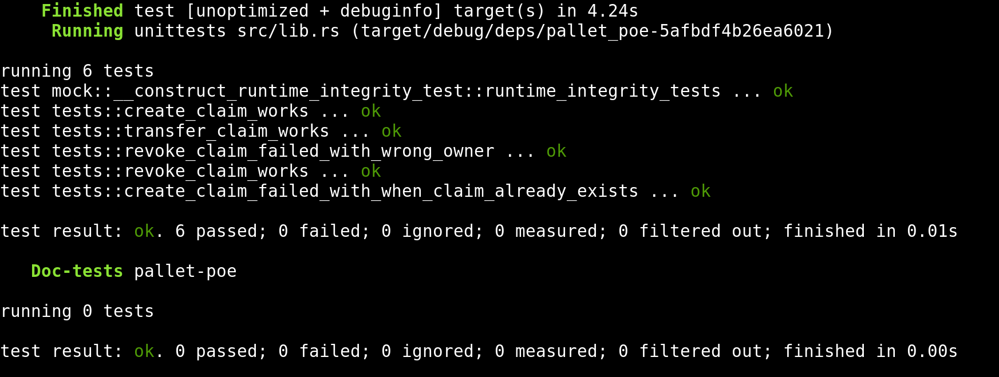

### Advanced-Substrate ch01
---

#### 1. Up and running
```bash
wget https://github.com/substrate-developer-hub/substrate-node-template/archive/refs/tags/polkadot-v0.9.40.tar.gz

# coding...

cargo fmt
cargo check -p pallet-poe --tests
cargo test -p pallet-poe -- transfer_claim_works
cargo test -p pallet-poe
```

#### 2. Results
- git repository: https://github.com/d2jvkpn/substrate-node-template-polkadot-v0.9.40
- command
```bash
cargo test -p pallet-poe
```
- screenshots

