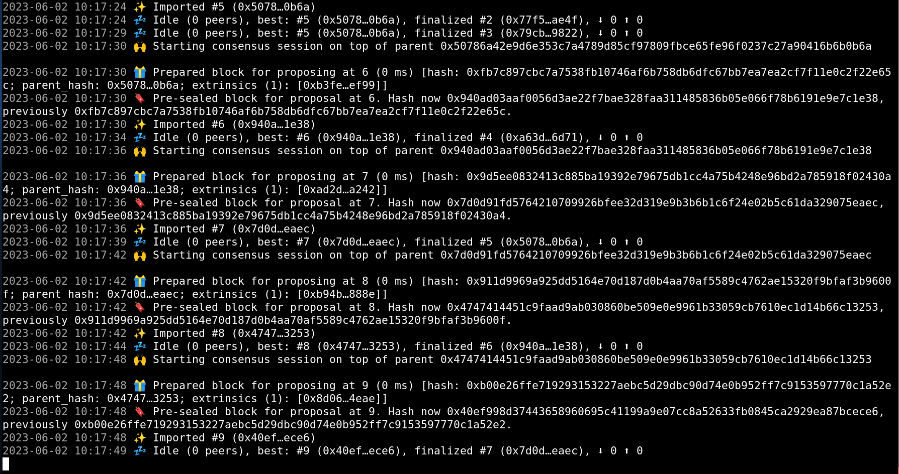

### Advanced-Substrate ch02
---

#### 1. Tests
- commands
```bash
cargo fmt
cargo check -p pallet-kitties --tests

cargo test -p pallet-kitties -- t_create
cargo test -p pallet-kitties -- t_breed
cargo test -p pallet-kitties -- t_transfer
```

git repository: https://github.com/d2jvkpn/substrate-node-template-polkadot-v0.9.40

#### 2. "04 Kitties"
- commands
```bash
cargo build -p pallet-kitties --release

cargo test -p pallet-kitties

cargo build --release

cargo run --release -- --dev
```
- screenshots




#### 3. "05 Test and assert events"
- commands
```bash
cargo test -p pallet-kitties
```
- screenshots

